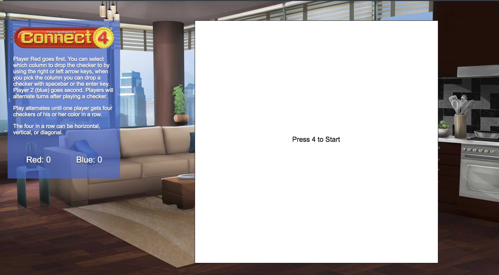
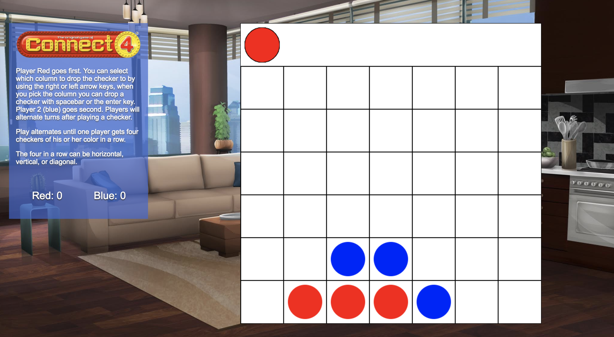
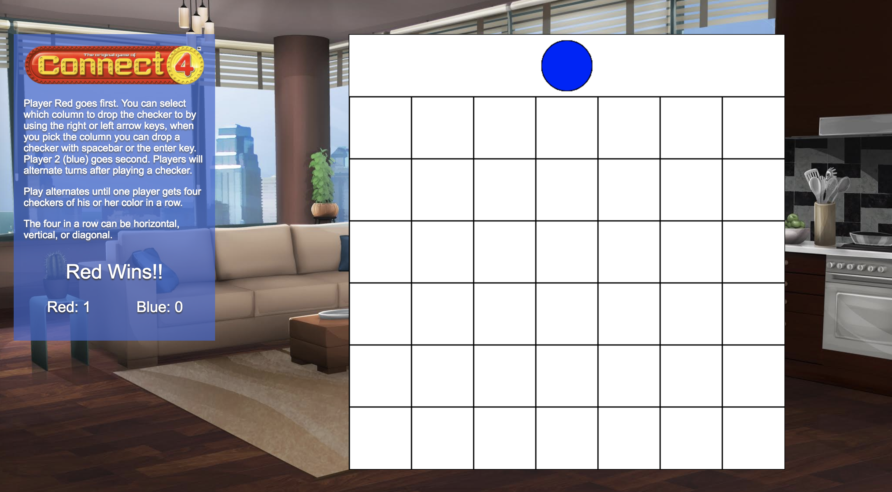

# Connect Four
## A Game Time Project (FE - Module 2)
### [Play here](https://mrayanne113.github.io/connect-four/ "play here")

### Goals
* Learn object oriented programming (OOP) principles by building a game that is playable in the browser.
* Use OOP to drive the design of the game and the code
* Separate business-logic code from view-related code
* Create a robust test suite that thoroughly tests all functionality of a client-side application

### Tools
* use OOP
* use es6
* use canvas
* testing ( mocha, chai )
* webpack
* ESlintering

## Playability Features
* [X] Indicate when the game is over and won or lost
* [X] Allow the user to start a new game
* [X] Display a score (if applicable)
* [X] Include a clean UI surrounding the actual game interface itself (this might include instructions on how to play, a high score saved in localStorage, etc. Think of what would be most intuitive for your particular game.)


## Installing

Clone or download this repo then run 


```npm install```


and then run to start the server

```npm start```

## Testing 

To run the testing suite

```npm test```

## Linting 

To the the eslint please use

```npm run eslint```


## Authors

[Camilo Snapp](https://github.com/CamArturo "His Github Homepage")

[Megan Kaiser](https://github.com/mrayanne113 "Her Github Homepage")

### On page load







